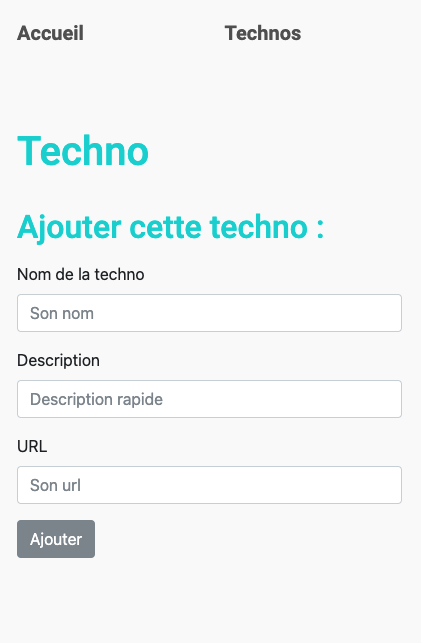
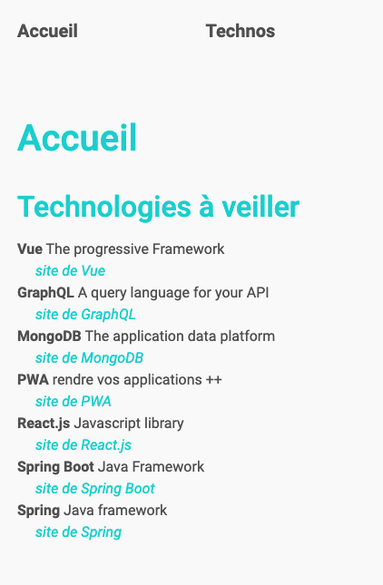

#  :calling: PWA

## 👉 Create a Progressive Web App 

## Illustration 






## 🛠 Language/tools 
- HTML5 / CSS3 / Bootstrap
- Javascript
- Node
  

## 🏔 Goals 
- Testing PWA construction
- Testing Notifications, Push Notifications
- Testing Background Sync
- Testing OffLine mode

## ⚙️ How to use 
### Project setup
```bash
npm install
```

### Compiles for development
```bash
npm run start
```
*Meeting on http://localhost:3000/*

### Launch the jsonServer 
```bash
npm run jsonserver
```
*Meeting on http://localhost:3001/technos*


## 🎯 Status
Project completed

## 🗓 Context
Project developed as a junior web developer during my BTS
